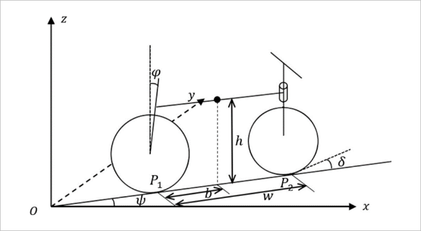
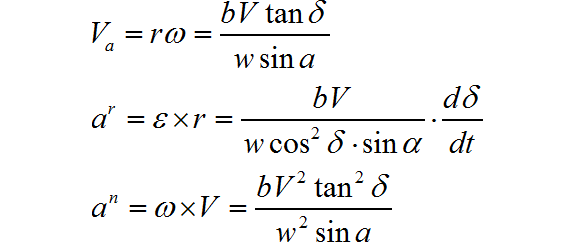

## 更新至V1.2

更新日志 2022/2/7

### 添加功能

#### 界面一

- 图片的显示
- 视频的显示
- 支持视频的暂停以及跳帧
- 六种二值化处理方法
- 图像滤波
- 二值化以及滤波参数ctrl+s一键保存
- 边线数组显示
- 支持对视频的单帧进行处理

#### 界面二

- 图片的显示
- 二值化视频与边线数组视频的显示
- 支持视频的暂停以及跳帧
- 边线数组的动态跟踪
- 支持对视频的单帧进行处理
- 单车运行状态参数动态监视
- 可视化展示单车转角以及车身倾角

### 一些学习链接

  [第十五届全国大学生智能汽车竞赛-双车组三轮图像处理总结_LeviKing98的博客-CSDN博客](https://blog.csdn.net/LeviKing98/article/details/107902795?spm=1001.2014.3001.5501)  

  [种子填充赛道算法【智能车】_钱钱、的博客-CSDN博客_八领域 智能车](https://blog.csdn.net/weixin_43981425/article/details/107679694)  

  [第十六届智能车比赛 - 全向组图像处理 - 程序解析_Lovely_him的博客-CSDN博客](https://blog.csdn.net/Lovely_him/article/details/119255431?spm=1001.2101.3001.6650.6&utm_medium=distribute.pc_relevant.none-task-blog-2%7Edefault%7EBlogCommendFromBaidu%7ERate-6.pc_relevant_paycolumn_v3&depth_1-utm_source=distribute.pc_relevant.none-task-blog-2%7Edefault%7EBlogCommendFromBaidu%7ERate-6.pc_relevant_paycolumn_v3&utm_relevant_index=13)  

  [智能车图像处理之透视变换_小陈敲代码的博客-CSDN博客_智能车图像处理](https://blog.csdn.net/qq_43568457/article/details/108549331?utm_medium=distribute.pc_relevant.none-task-blog-2~default~baidujs_baidulandingword~default-5.pc_relevant_paycolumn_v3&spm=1001.2101.3001.4242.4&utm_relevant_index=8)  

### 下一步目标

学习八邻域生长算法、学习透视变换算法、提高对单帧图像的处理速度、提高对赛道元素识别的稳定性

## 一些资料

## 单车平衡与转向控制

### 单车平衡原理

  将自行车机器人看成由前轮、后轮以及车架所组成，并假设系统所有的质量都集中于质心上，根据质点系相对于动轴的动量矩定理，建立起自行车机器人的动力学方程，得到其单输入单输出系统的线性化模型。

​                                                           自行车机器人系统简化结构示意图
  自行车机器人系统的结构参数如上图所示。将自行车的前后轮与地面的接触点记为 $P_2$ 和  $P_1$，两触点间形成一条接触线$P_2 P_1  , P_2 P_1$与x轴之间的夹角定义为偏航角$Ψ ， P_2 P_1 $的距离记为$w$。假定质心高度为$h$，质心在水平面上的投影点与 $P_1$ 的距离记为$b$。车体与$z$轴的夹角记为倾斜角$Φ$，前轮的摆角记为操纵角$δ$。

​                                                               自行车机器人结构俯视图
  自行车机器人结构的俯视图如上图所示。设自行车机器人在水平面内作平面运动，分别作点$P_1$和$P_2$的速度垂线并相交于$Q$点，$Q$点即为接触线在水平面内作平面运动时的速度瞬心。设车体质量为$m$，自行车相对于接触线$P_2P_1$的转动惯量为$J$，后轮的速度为$V$。由此，得到自行车机器人做平面运动时的角速度和加速度分别为

  自行车机器人的质心在水平面的投影点绕点$Q$转动，得到其速度$V_a$，切向加速度$a_r$，法向加速度$a_n$的表达式分别为

  系统所受的牵引惯性力为切向牵引惯性力和法向牵引惯性力的矢量和，其大小为

  依据刚体绕定轴转动微分方程 $J ∗ α = ∑M_i$，得到系统动力学方程为

  当车体竖直时，可以认为各角度均为小量，即可得到系统的线性化模型为

### 单车平衡的稳定性分析与仿真

  由前式推导得出的系统线性化模型进一步分析，其开环传递函数为

  可知系统的零点为$ −V/b$ ，极点为 $ \pm \sqrt {g/h}$ ，在$s$域的右半平面始终存在一个极点，故开环系统不稳定。对该系统构造简单比例反馈闭环系统，令 $δ = − k ϕ$ ,得到此时闭环系统的特征方程为

 

  计算得出闭环系统特征根为

  由此得到使得特征根位于s平面左侧时的反馈系数k与车速V的关系不等式为

  依据上式，定性得到了车速越大时闭环系统所需反馈系数越小的规律，反映在控制过程中，即车速越大时为了保持车身直立所需要的车把转动角度就越小。

  进一步对控制模型进行修正与完善，将车体看成由四个刚体即车架、前轮、后轮、车把组成，考虑后轮转速、前轮转角对自行车平衡控制过程中的贡献，即后轮车速、前轮转角与车体横滚角之前的定量关系。利用matlab对所建立的动力学方程进行仿真分析如下

​                                           车身横滚角度一定时后轮转速与前轮转角的关系
  保持车身横滚角一定时，后轮转速与前轮转角的关系如图4.4所示。车速越慢，保持一定车身横滚角所需要的前轮转角就越大，反之则越小。并且，车速越慢，所能维持稳定动平衡的车身横滚角就越小。

​                                           后轮转速一定时车身横滚角度与前轮角度的关系
  保持后轮转速一定时，车身横滚角度与前轮转角的关系如图4.5所示。一定范围内，车身横滚角越大，所需要的前轮转角就越大。且随着车速的提高，维持相同的车身横滚角所需要的前轮转角就越小。

4.2.3 单车平衡与转弯
  自行车机器人的转向控制通过改变目标平衡倾角从而改变车身动态平衡时的平衡姿态，做平面圆周运动。其转弯半径值由舵机打角、目标平衡倾角来决定。后轮转速则影响了最大的平衡倾角以及一定平衡倾角下舵机打角值从而改变了转弯半径大小。而后轮速度、舵机打角、车身倾角与转弯半径之间的关系为一个比较复杂的非线性关系。

  实际调试中发现，在小倾角情况下，平衡控制效果。但是在左右转向时呈现出了一个极为明显的左右转不对称性，分析为自行车机器人的自身质量分布不均匀引起的。观察发现，龙邱汽车电子提供的K车模自身结构存在一个不对称的设计，即后轮电机没有居中放置而是偏右，从而使得车的重心偏右，引起转弯性能不对称的现象。

​                                                   车速一定，不同倾角下对应转弯曲率关系
  如图4.6所示，保持车速一定，改变车身目标倾角时记录车做稳定圆周运动时的半径的倒数即曲率大小。车身机械中值为3.7，左转时目标倾角正向增大，右转时目标倾角反向减小。分析发现，目前车身质量分布具有较大的不对称性，表现为左转时转弯半径的变化率是右转时的两倍左右，即相对于车身机械中值左右偏离相同倾角下，左转的转弯半径较右转时的要更小。

  通过添加配重块可以一定程度上改善由车模本身质量分布不均匀引起的左右转弯性能不对称的问题。

  除了左右转弯性能不对称的问题，单车的直立控制只采用PD控制，不引入I项，便会存在一个静态误差，实际倾角往往会大于目标倾角，但是由于I项的惯性，在高速时便容易引起单车直立环发散，对此我们先采集数据，得到单车实际倾角与舵机打角的关系，然后在最终控制器的输出值叠加上这个拟合值，基本可以实现实际倾角与目标倾角相贴合，并且单车的直立环不会发散。

  单车的直立控制配合上电机速度的加减速便可辅助单车的转向，单车的加减速同样采用PID控制器，输入单车的实际倾角与目标倾角的差值，若实际倾角小于目标倾角则减速，反之则加速，这样不但可以辅助单车的平衡，而且实际循迹的过程中可以达到入弯减速，出弯加速，达到过弯压弯的效果。

给定的智能车参数列表：

| 参数名                     | 变量名        | 参数值                                 |
| -------------------------- | ------------- | -------------------------------------- |
| 偏航角                     | $Ψ$           |                                        |
| 车轮距                     | $w$           | $18.9cm$                               |
| 车轮半径                   | $r$           | $3.375cm$                              |
| 质心高度                   | $h$           | $7cm$                                  |
| 质心投影与$P_1$距离        | $b$           | $9.425cm$                              |
| 车体倾角                   | $Φ$           |                                        |
| 舵机转角                   | $δ$           | $\leq30^o or (arctan{c/1.5\over 40} )$ |
| 车体质量                   | $m$           | $0.7kg$                                |
| 后轮速度（车速）           | $V$           | $2m/s$                                 |
| 角速度                     | $\omega$      | $MPU$                                  |
| 角加速度                   | $\varepsilon$ |                                        |
| 质心线速度                 | $V_a $        | $R\omega$                              |
| 质心切向加速度             | $a_r $        |                                        |
| 质心法向加速度             | $a_n $        |                                        |
| 牵引惯性力                 | $F$           |                                        |
| 转动惯量                   | $J$           |                                        |
| 摩擦系数                   | $\mu$         |                                        |
| 过弯最大车速               | $V_{max} $    | $\sqrt{\mu gR}$                        |
| 过弯最大倾角               | $Φ_{max}$     | $arctan{1\over\mu}$                    |
| 固定车速下的过弯的最小倾角 | $Φ_{min}$     | $arctan{Rg\over V_a^2}$                |
| 主跑行与中线差值           | $c$           |                                        |
| 跑道环路与转弯半径         | $R$           | $\geq50cm$                             |

假设质心在正中间，参数需调整$h$,$b$,$m$,$V$,$R$,$J$

计算舵机转角：

